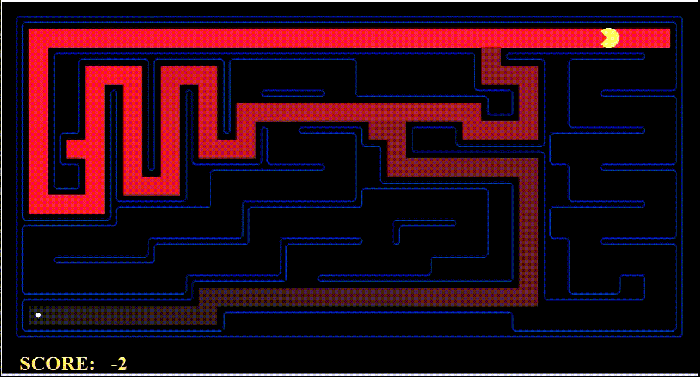
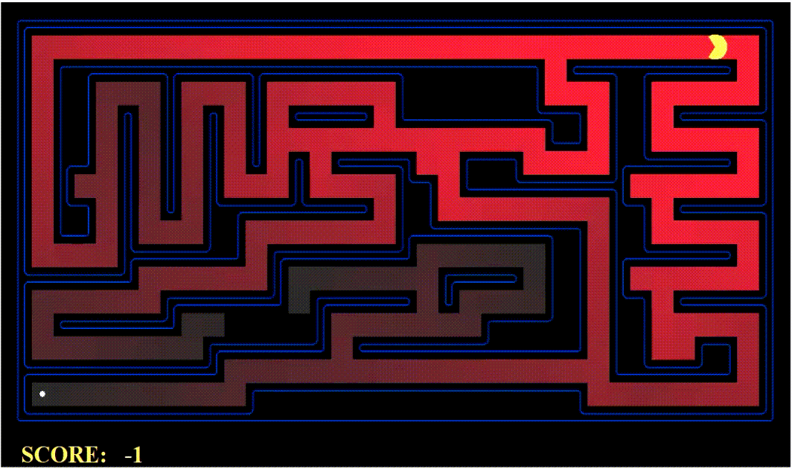
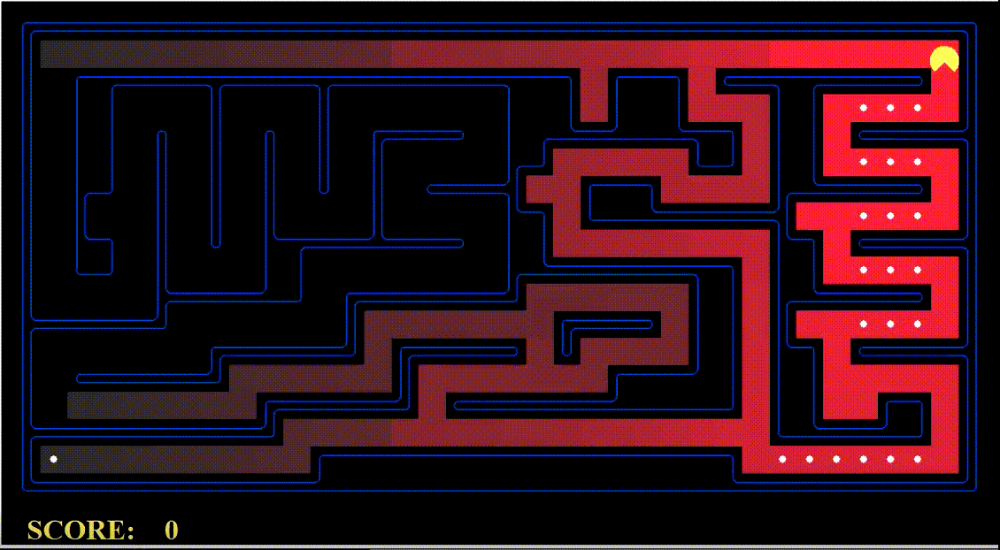
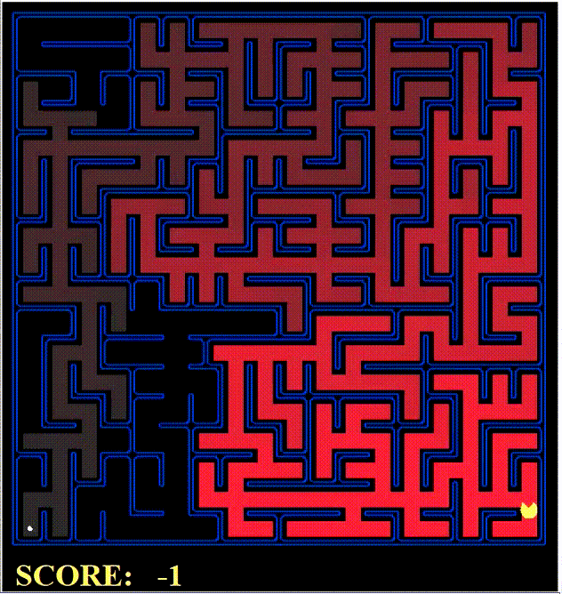

<h1 align="center"> Pacman Agent </h1>
<h3 align="center"> COMP 6721 - Artificial Intelligence </h3>
<h5 align="center"> Project Assignment 1 - <a href="https://www.concordia.ca/">Concordia University</a> (Winter 2020) </h5>

 
  

<!-- TABLE OF CONTENTS -->
<h2 id="table-of-contents"> :book: Table of Contents</h2>

  
Table of Contents

  <ol>
    <li><a href="#about-the-project"> ➤ About The Project</a></li>
    <li><a href="#overview"> ➤ Overview</a></li>
    <li><a href="#project-files-description"> ➤ Project Files Description</a></li>
    <li><a href="#getting-started"> ➤ Getting Started</a></li>
    <li><a href="#scenario1"> ➤ Scenario 1: Depth First Search </a></li>
    <li><a href="#scenario2"> ➤ Scenario 2: Breadth First Search </a></li>
    <li><a href="#scenario3"> ➤ Scenario 3: Uniform Cost Search </a></li>
    <li><a href="#scenario4"> ➤ Scenario 4: A* search algorithm </a></li>
    <li><a href="#scenario5"> ➤ Scenario 5: Finding All the Corners </a></li>
    <li><a href="#scenario6"> ➤ Scenario 6: Admissible and Consistent Heuristic </a></li>
    <li><a href="#scenario7"> ➤ Scenario 7: Eating All Dots </a></li>
    <li><a href="#scenario8"> ➤ Scenario 8: Suboptimal Search </a></li>
    <li><a href="#references"> ➤ References</a></li>
    <li><a href="#credits"> ➤ Credits</a></li>
  </ol>

<!-- ABOUT THE PROJECT -->
<h2 id="about-the-project"> :pencil: About The Project</h2>

 
  For those of you not familiar with Pacman, it's a game where Pacman (the yellow circle with a mouth in the below figure) moves around in a maze and tries to eat as many food pellets (the small white dots) as possible, while avoiding the ghosts (the other two agents with eyes in the above figure). If Pacman eats all the food in a maze, it wins.

<!-- OVERVIEW -->
<h2 id="overview"> :cloud: Overview</h2>

 
  In this project, the Pacman agent will find paths through his maze world, both to reach a particular location and to collect food efficiently. I implemented general search algorithms such as depth-first, breadth-first, uniform cost, and A* search algorithms which are used to solve navigation problems in the Pacman world.

<!-- PROJECT FILES DESCRIPTION -->
<h2 id="project-files-description"> :floppy_disk: Project Files Description</h2>

<ul>
  <li><b>search.py</b> - Where all of the search algorithms reside.</li>
  <li><b>searchAgents.py</b> - Where all of the search-based agents reside.</li>
  <li><b>pacman.py</b> - The main file that runs Pacman games. This file also describes a Pacman GameState types.</li>
  <li><b>game.py</b> - The logic behind how the Pacman world works.</li>
  <li><b>util.py</b> - Useful data structures for implementing search algorithms.</li>
</ul>

<h3>Some other supporting files</h3>
<ul>
  <li><b>graphicsDisplay.py</b> - Graphics for Pacman.</li>
  <li><b>graphicsUtils.py</b> - Support for Pacman graphics.</li>
  <li><b>textDisplay.py</b> - ASCII graphics for Pacman.</li>
  <li><b>ghostAgents.py</b> - Agents to control ghosts.</li>
  <li><b>keyboardAgents.py</b> - Keyboard interfaces to control Pacman.</li>
  <li><b>layout.py</b> - Code for reading layout files and storing their contents.</li>
  <li><b>autograder.py</b> - Project autograder.</li>
  <li><b>testParser.py</b> - Parses autograder test and solution files.</li>
  <li><b>testClasses.py</b> - General autograding test classes.</li>
  <li><b>test_cases/</b> - Directory containing the test cases for each scenario.</li>
  <li><b>searchTestClasses.py</b> - Project specific autograding test classes.</li>
</ul>

<!-- GETTING STARTED -->
<h2 id="getting-started"> :book: Getting Started</h2>

You are able to start the game by typing the following commands in the command line:

<pre><code>$ python pacman.py</code></pre>

You can see the list of all options and their default values via:

<pre><code>$ python pacman.py -h</code></pre>
<i>Note that all of the commands that appear in this project also appear in <code>commands.txt</code>, for easy copying and pasting.</i>

<!-- SCENARIO1 -->
<h2 id="scenario1"> :small_orange_diamond: Scenario 1: Finding a Fixed Food Dot using Depth First Search</h2>

I have implemented the depth-first search (DFS) algorithm in the depthFirstSearch function in <code>search.py</code>.

The Pacman will quickly find a solution via running the following commands:

<pre><code>$ python pacman.py -l tinyMaze -p SearchAgent</code></pre>
<pre><code>$ python pacman.py -l mediumMaze -p SearchAgent</code></pre>
<pre><code>$ python pacman.py -l bigMaze -z .5 -p SearchAgent</code></pre>

 

<!-- SCENARIO2 -->
<h2 id="scenario2"> :small_orange_diamond: Scenario 2: Finding a Fixed Food Dot using Breadth First Search</h2>

I have implemented the breadth-first search (BFS) algorithm in the breadthFirstSearch function in <code>search.py</code>.

I wrote a graph search algorithm that avoids expanding any already visited states.

The Pacman will quickly find a solution via running the following commands:

<pre><code>$ python pacman.py -l mediumMaze -p SearchAgent -a fn=bfs</code></pre>
<pre><code>$ python pacman.py -l bigMaze -p SearchAgent -a fn=bfs -z .5</code></pre>

 

<!-- SCENARIO3 -->
<h2 id="scenario3"> :small_orange_diamond: Scenario 3: Finding the best path using Uniform Cost Search</h2>

I have implemented the uniform-cost graph search (UCS) algorithm in the uniformCostSearch function in <code>search.py</code>.

While BFS will find a fewest-actions path to the goal, UCS will find paths that are “best” in other senses.

UCS agents differ only in the cost function they use.

The Pacman will quickly find a solution via running the following commands:

<pre><code>$ python pacman.py -l mediumMaze -p SearchAgent -a fn=ucs</code></pre>
<pre><code>$ python pacman.py -l mediumDottedMaze -p StayEastSearchAgent</code></pre>
<pre><code>$ python pacman.py -l mediumScaryMaze -p StayWestSearchAgent</code></pre>

 

<!-- SCENARIO4 -->
<h2 id="scenario4"> :small_orange_diamond: Scenario 4: Finding the best path using A* search algorithm</h2>

I have implemented the A* graph search algorithm in the aStarSearch function in <code>search.py</code>.

I used Manhattan distance as the heuristic function.

A* finds the optimal solution slightly faster than Uniform Cost Search.

The Pacman will quickly find a solution via running the following command:

<pre><code>$ python pacman.py -l bigMaze -z .5 -p SearchAgent -a fn=astar,heuristic=manhattanHeuristic</code></pre>

 

<!-- SCENARIO5 -->
<h2 id="scenario5"> :small_orange_diamond: Scenario 5: Finding All the Corners</h2>

I have implemented a search algorithm in <code>searchAgents.py</code> that helps Pacman agent to find the shortest path through the maze that touches all four corners.

The Pacman will quickly find a solution via running the following commands:

<pre><code>$ python pacman.py -l tinyCorners -p SearchAgent -a fn=bfs,prob=CornersProblem</code></pre>
<pre><code>$ python pacman.py -l mediumCorners -p SearchAgent -a fn=bfs,prob=CornersProblem</code></pre>

 

<!-- SCENARIO6 -->
<h2 id="scenario6"> :small_orange_diamond: Scenario 6: Corners Problem - Admissible and Consistent Heuristic</h2>

I have implemented a non-trivial non-negative consistent heuristic function that returns 0 at every goal state and never returns a negative value.

This function is both <b><i>Admissible</b></i> and <b><i>Consistent</b></i> and has been written in <code>searchAgents.py.</code>

The Pacman will quickly find a solution via running the following command:

<pre><code>$ python pacman.py -l mediumCorners -p AStarCornersAgent -z 0.5</code></pre>

 

<!-- SCENARIO7 -->
<h2 id="scenario7"> :small_orange_diamond: Scenario 7: Eating All The Dots</h2>

I have implemented a heuristic function that helps Pacman agent to eat all the food in as few steps as possible.

The Pacman will quickly find a solution via running the following command:

<pre><code>$ python pacman.py -l trickySearch -p AStarFoodSearchAgent</code></pre>

 

<!-- SCENARIO8 -->
<h2 id="scenario8"> :small_orange_diamond: Scenario 8: Suboptimal Search</h2>

In this scenario, I have implemented a function that helps Pacman agent to find a path to the closest dot.

This function has been written in <code>searchAgents.py</code>

The Pacman will quickly find a solution via running the following command:

<pre><code>$ python pacman.py -l bigSearch -p ClosestDotSearchAgent -z .5</code></pre>

 

<!-- CREDITS -->
<h2 id="credits"> :scroll: Credits</h2>

✤ <i>This was the homework project for the course COMP 6721 - Artificial Intelligence (Winter 2020), at <a href="https://www.concordia.ca/">Concordia University</a><i>  
  <i>Author: Mohammad Amin Shamshiri</i>

  

